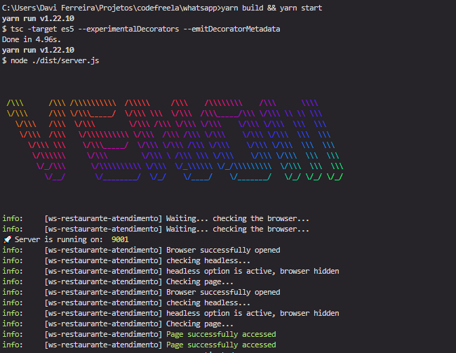

# 🤖 Whatsapp-bot !


## Tags

[Typescript](https://www.typescriptlang.org/), [venom](https://github.com/orkestral/venom). 

---

## Table of contents 

[Fases do Projeto](#fases-do-projeto) <br>
[Descrição](#descrição) <br>
[Antes de Começarmos](#antes-de-começarmos) <br>
[Arquitetura](#arquitetura) <br>
[Iniciando](#iniciando) <br>
[Rotas](#routes) <br>
[Security](#security) <br>
[O que vem por ai ?](#O-que-vem-por-ai?) <br>

---

## Fases do Projeto

**🏆 MVP**

- [x] pré desenolvimento
- [x] desenvolvimento
- [x] testes
- [ ] lançamento v 1.0

---

## Descrição

Este projeto foi desenvolvido com o intuito de ser uma alternativa às limitações da API oficial do Whatsapp, desenvolvida em Typescript, NodeJS e Venom.

Ao longo da documentação irei explicar com detalhes sobre o produto e como este deverá ser usado.

Hoje o QRCode pelo backend até o frontend não será possível, estou estudando uma alternativa, mas hoje encontra-se indisponível devido às dependências x latência com que esses dados sejam processados. Um arquivo chamado test.ts 


---

## Antes de Começarmos

Como trata-se de uma API que será uma alternativa à oficial, muitos recursos ficaram limitados, muitos das suas funcionalidades podem sofrer algum tipo de deterioração sem aviso prévio, através de alguma diretriz, atualização, ou política da Meta.

---

## Iniciando:

Passos para instalação: 

verifique se o nodejs está instalado na sua máquina, caso não, instale via [NodeJS](https://nodejs.org/en/).

Após sua instalação, instale o YARN (gerenciador de pacotes). 
```
npm i --global yarn

```

Depois de feita sua instação, inicie com:

```
yarn install

```


e realize o comando abaixo: 

```
yarn deploy:local

```

---

## Arquitetura


├───src<br>
│   └───app<br>
│       ├───routes<br>
│       ├───useCases<br>
│       │   ├───ReplyMessage<br>
│       │   │   ├───controllers<br>
│       │   │   └───services<br>
│       │   └───SendTextMessage<br>
│       │       ├───controllers<br>
│       │       └───services<br>
│       └───utils<br>
│           ├───config<br>
│           ├───helpers<br>
│           ├───interfaces<br>
│           └───messages<br>
<br>

Quando buildamos, todo código é transpilado para javascript e um novo diretório é criado chamado "dist'.




---


## Rotas

URL Base: <br>
```
http://localhost:9001
``` 
Criar Mensagens

```
[POST] http://localhost:9001/api/send
''' 
 
{
	"to": "5535912345678",
	"body": "Olá, boa tarde ! como vai ?"
}
'''
```

O Whatsapp usa o seguinte padrão para poder usar números: 

DDI + DDD + NÚMERO + @c.us <br>
55     11   9 12345678 @c.us

5511912345678@c.us

**Para o fluxo ocorrer de maneira adequada:**
O Cliente do restaurante deve ser redirecionado para o link :


````
https://wa.me/${numeroDoRestaurante}&text=${textoPersonalizado}

````

numeroDoRestaurante no formato 5535912345678
textoPersonalizado poderá ser um texto do formato que desejar para o cliente entrar em contato com o restaurante, como exemplo abaixo:

```

"Olá, me chamo xyz, acabei de finalizar o pedido n. 1234abcd... no dia DD/MM/AAAA"

```

Assim o número do cliente ficará seguro para não ser confundido com spam. 

O próximo passo é usar apenas a rota POST para fazer a comunicação simulando o restaurante.


---


## Segurança

 Será necessário fechar as comunicações entre servidores, serviços e demais protocolos. CORS está totalmente exposto.

---

## O que vem por ai?

Estudar novas implementações e assim disponibilizar v.2
Há muito que há ser explorado com este framework.

---

- @dribeiroferr